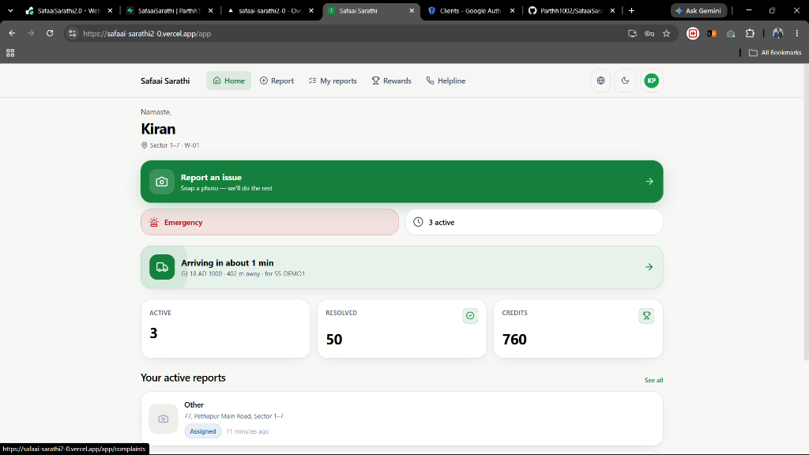
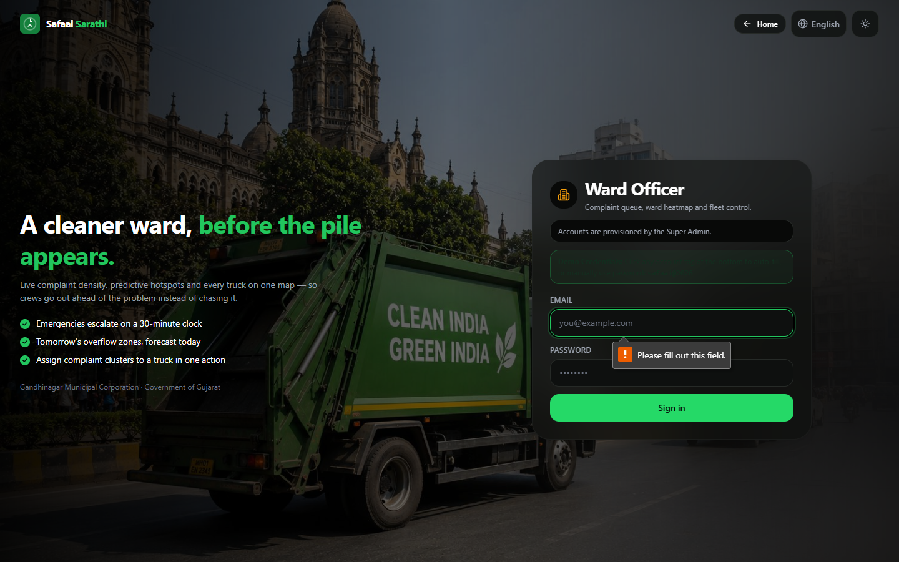
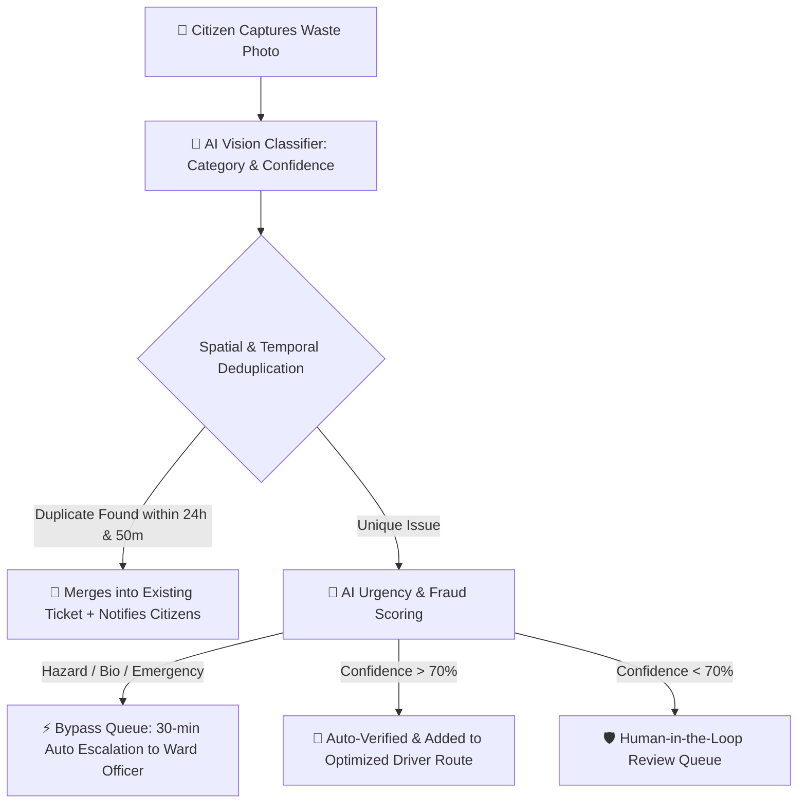
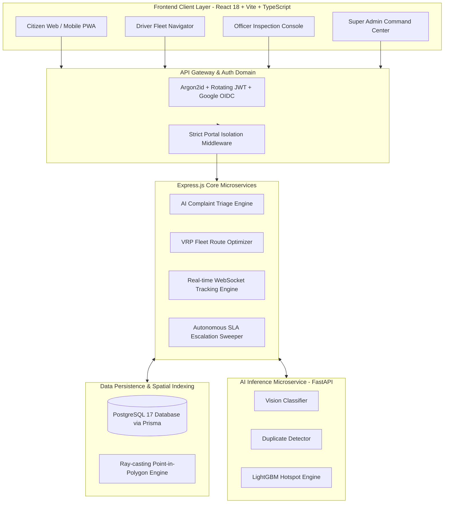

<div align="center">


<br/>

<a href="https://safaai-sarathi2-0.vercel.app" target="_blank">
  
</a>

<br/>

[](https://reactjs.org/)
[](https://nodejs.org/)
[](https://www.postgresql.org/)
[](https://threejs.org/)
[](https://github.com/)

<br/>


<br/>

> **🚀 "Transforming Municipal Waste Management from Passive Grievance Redressal into Proactive, Real-time AI Triage & Dynamic Fleet Logistics."**

[🌐 **LIVE PLATFORM**](https://safaai-sarathi2-0.vercel.app) &nbsp;•&nbsp; [⚙️ **API ENDPOINT**](https://safaaisarathi2-0.onrender.com) &nbsp;•&nbsp; [📑 **ARCHITECTURE**](#-system-architecture)

</div>

---

<br/>

<div align="center">
  
</div>

<br/>

Traditional municipal portals are essentially simple form dropboxes: citizens upload a complaint, it sits in an unread, unstructured database, and takes weeks to be manually sorted. **Safaai Sarathi 2.0** completely re-engineers civic operations with a proactive, **Intelligent Autonomous Triage Layer**:

- **🤖 Zero Fake Complaints (AI Fraud Shield):** Analyzes EXIF metadata, camera lens characteristics, Shannon entropy, and location authenticity to mathematically reject duplicate or downloaded spam images.
- **⚡ Instant Emergency Escalation:** Medical waste, dead animals, and chemical hazards bypass human delay with an automated **30-minute SLA countdown timer**.
- **🔗 Smart Duplicate Merging:** When 10 citizens photograph the same overflowing bin, it doesn't create 10 redundant tickets; it merges them into a single high-priority node using **ResNet visual embeddings** and spatial radii.
- **📸 Mandatory Photo-Proof Resolution:** A driver cannot close a ticket by simply clicking a checkbox. The API mathematically blocks resolution unless an authentic post-cleanup photo is provided.
- **📍 Rotated & Interpolated Live GPS Tracking:** Google Maps-style 60 FPS smooth truck movement on custom Leaflet vector maps.

<br/>

---

<div align="center">
  
</div>

<br/>

<div align="center">

### 🟢 Citizen Interface & Landing
| 🚛 **3D Interactive Drive-by Intro** | 🏛️ **Official Glassmorphic Landing Page** |
| :---: | :---: |
|  |  |
| *Real-time Three.js 6x4 heavy municipal EV truck with active beacon, road lighting & physics* | *Live Gandhinagar DB stats, Government of India tricolor, and glassmorphic quick-report* |

<br/>

### 🟢 Gamification & Real-Time Tracking
| 📍 **Live Interpolated Truck Tracking** | 🏆 **Gamified Green Credits & Wallet** |
| :---: | :---: |
|  |  |
| *Live WebSocket heading-rotated GPS truck position, distance & 1-minute arrival ETA* | *Civic reward system: +5 report, +15 verified. Seamless voucher clipboard claiming.* |

<br/>

### 🟢 Fleet Logistics & Ward Triage
| 🚛 **Driver Turn-by-Turn VRP Navigator** | 🛡️ **Ward Officer Live Inspection Queue** |
| :---: | :---: |
|  |  |
| *Optimized pickup stops with Or-Opt solver, battery telemetry, and 1-tap SOS* | *Point-in-polygon triage, 30-min SLA timer, and enforced photo-proof validation* |

</div>

<br/>

---

<div align="center">
  
</div>

<br/>

<div align="center">
  
</div>

<br/>

<details>
<summary><b>Click to expand detailed tech-stack breakdown</b></summary>
<br/>

| Domain | Technology / Library | Role & Justification |
| :--- | :--- | :--- |
| **Frontend Framework** | `React 18`, `TypeScript`, `Vite` | Ultra-fast client-side SPA with high type safety and sub-second builds. |
| **Styling & UI** | `Tailwind CSS`, `Framer Motion` | True light/dark theme variables, pure `#000` AMOLED mode & animated micro-interactions. |
| **3D Graphics** | `Three.js`, `@react-three/fiber` | Full-screen 3D dynamic driving truck intro with physics. |
| **Mapping & Spatial** | `Leaflet`, `React-Leaflet` | Real-time interpolated GPS markers, ward boundary polygons & pathing. |
| **Backend API** | `Node.js`, `Express.js` | High-concurrency event-driven architecture. |
| **Database & ORM** | `Prisma ORM`, `PostgreSQL 17` | Relational integrity with 17 schema models & strict audit logging. |

</details>

<br/>

---

<div align="center">
  
</div>

<br/>

Safaai Sarathi operates a dedicated micro-service hosting specialized AI models:



### 🔬 Specialized Models in Production
1. **👁️ Vision Waste Classifier (PyTorch/CNN):** 9-Class Waste Classification (Piles, Overflowing Bins, Medical, Bio-Waste).
2. **🧬 Duplicate Similarity Embedder:** Cosine similarity on 512-dim visual feature vectors using a ResNet Backbone + Haversine spatial radius.
3. **🔮 Hotspot Predictor:** LightGBM Gradient Boosted Decision Trees trained on 45-day temporal civic data.
4. **🗺️ Fleet Routing Solver:** TSP & VRP Solver with Nearest-Neighbor, 2-Opt edge swaps & Emergency locking.

<br/>

---

<div align="center">
  
</div>

<br/>



<br/>

---

<div align="center">
  
</div>

<br/>

Safaai Sarathi is **not** a single dashboard with a role dropdown. Each portal is an **independent, isolated security silo**:

| Portal | Role | Access Policy & Isolation Rules |
| :--- | :--- | :--- |
| **Citizen Portal** | `CITIZEN` | Public self-signup, Google OAuth, self-ticket tracking, Green Credits wallet. |
| **Driver Portal** | `DRIVER` | Admin-provisioned, phone OTP login, offline GPS sync, turn-by-turn route. |
| **Ward Officer** | `OFFICER` | Admin-provisioned, TOTP 2FA, scoped exclusively to assigned municipal ward. |
| **Super Admin** | `ADMIN` | City-wide oversight, fleet management, model health monitoring, audit trail. |

> 🔒 *A Citizen JWT token attempting to hit `/api/officer/*` or `/api/admin/*` receives an immediate `403 PORTAL_MISMATCH` rejection.*

<br/>

---

<div align="center">
  
</div>

<br/>

- [x] **Phase 1:** Core Portals, AI Triage & Database Architecture.
- [x] **Phase 2:** Live GPS Tracking, Real-time WebSockets & VRP Routing.
- [x] **Phase 3:** Gamification, 3D Landing Page & Multilingual Support.
- [ ] **Phase 4:** Drone-based automated scanning & API integrations with Swachhata.
- [ ] **Phase 5:** Hardware IoT bin sensors integration.

<br/>

---

<div align="center">
  
</div>

<br/>

### 1️⃣ Clone & Install Dependencies
```bash
git clone https://github.com/Parthh1002/SafaaiSarathi2.0.git
cd "SafaaiSarathi2.0/Waste Management"
npm run install:all
```

### 2️⃣ Configure Environment Variables & Setup
```bash
# Push schema and seed deterministc data
npm run db:push     # Creates all 17 tables with relations
npm run seed        # Seeds Gandhinagar city, 8 wards, fleet, 45-day history

# Launch Concurrently
npm run dev         # Launches Web (5273) + API (5100) + AI (8100)
```

<br/>

---

<div align="center">


*Safaai Sarathi 2.0 — Built to empower citizens, drivers, and municipal administrators.* 🇮🇳

</div>
